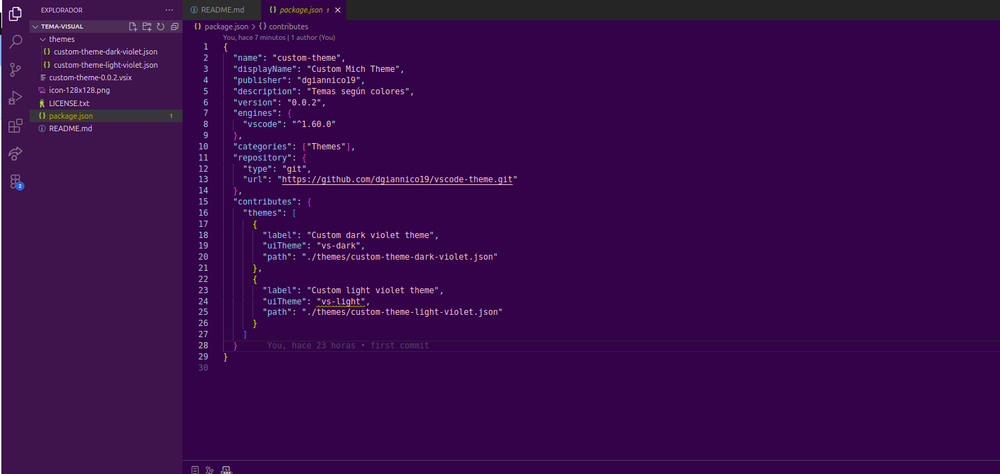

# Custom Mich Pastel Theme for Visual Studio Code

## Descripción

**Custom Mich Pastel Theme** es un tema personalizado para Visual Studio Code diseñado especialmente para poder adaptar un theme a mi necesidad y a su vez ir agregando mas. Estos themes ofrecen una experiencia visual agradable y relajante, con un enfoque en la legibilidad y la estética. 

### Características

- **Tonos pastel**: Colores suaves y armoniosos que hacen que el código sea fácil de leer.
- **Versiones Light y Dark**: Elige entre una experiencia clara y luminosa o una opción más oscura y acogedora.
- **Enfoque en el violeta**: Colores inspirados en el violeta que aportan un toque único al entorno de desarrollo.
- **Enfoque en paleta**: Colores inspirados en paleta de colores que aportan un toque único al entorno de desarrollo.
- **Optimización de contraste**: Colores cuidadosamente seleccionados para asegurar una buena legibilidad y una experiencia de codificación agradable.
- **Tonos relacionados a paleta de colores específica.

- ACTUALMENTE NO ESTA PUBLICADA PARA INSTALAR DIRECTAMENTE 

## Precondiciones

1. Tener instalada la herramienta para empaquetar el theme (vsce)

## Instalación

1. Abre Visual Studio Code en la carpeta del proyecto.
2. Correr comando vsce package (ampaqueta la extension)
3. Ve a la pestaña de **Extensiones** (`Ctrl+Shift+X`).
4. Clickear en opciones y seleccionar la opcion "Instalar desde VSIX..."
5. Busca en la carpeta del proyecto, el archivo con extension .vsix.
4. Haz clic en **Instalar**.
5. Ve a la configuración del tema (`File > Preferences > Color Theme`) y selecciona alguno de la lista.

## Uso

Para cambiar entre los temas, sigue estos pasos:

1. Abre la paleta de comandos (`Ctrl+Shift+P`).
2. Escribe "Color Theme" y selecciona `Preferences: Color Theme`.
3. Elige entre los disponibles.

## Contribuciones

¡Las contribuciones son bienvenidas! Si deseas mejorar el theme o agregar nuevas características, siéntete libre de abrir un **issue** o enviar un **pull request**.

### Reglas para contribuir

1. Fork el repositorio.
2. Crea una nueva rama (`git checkout -b feature/nueva-caracteristica`).
3. Realiza tus cambios y haz commit (`git commit -m 'Agregada nueva característica'`).
4. Haz push a la rama (`git push origin feature/nueva-caracteristica`).
5. Abre un Pull Request.

## Licencia

Este proyecto está bajo la Licencia MIT - consulta el archivo [LICENSE](LICENSE) para más detalles.

## Agradecimientos

Gracias a [Visual Studio Code](https://code.visualstudio.com/) por ser una plataforma tan increíble para el desarrollo y a [Markdown](https://www.markdownguide.org/) por facilitar la creación de documentación elegante.

---

**¡Disfruta de tu codificación con el tema!**
